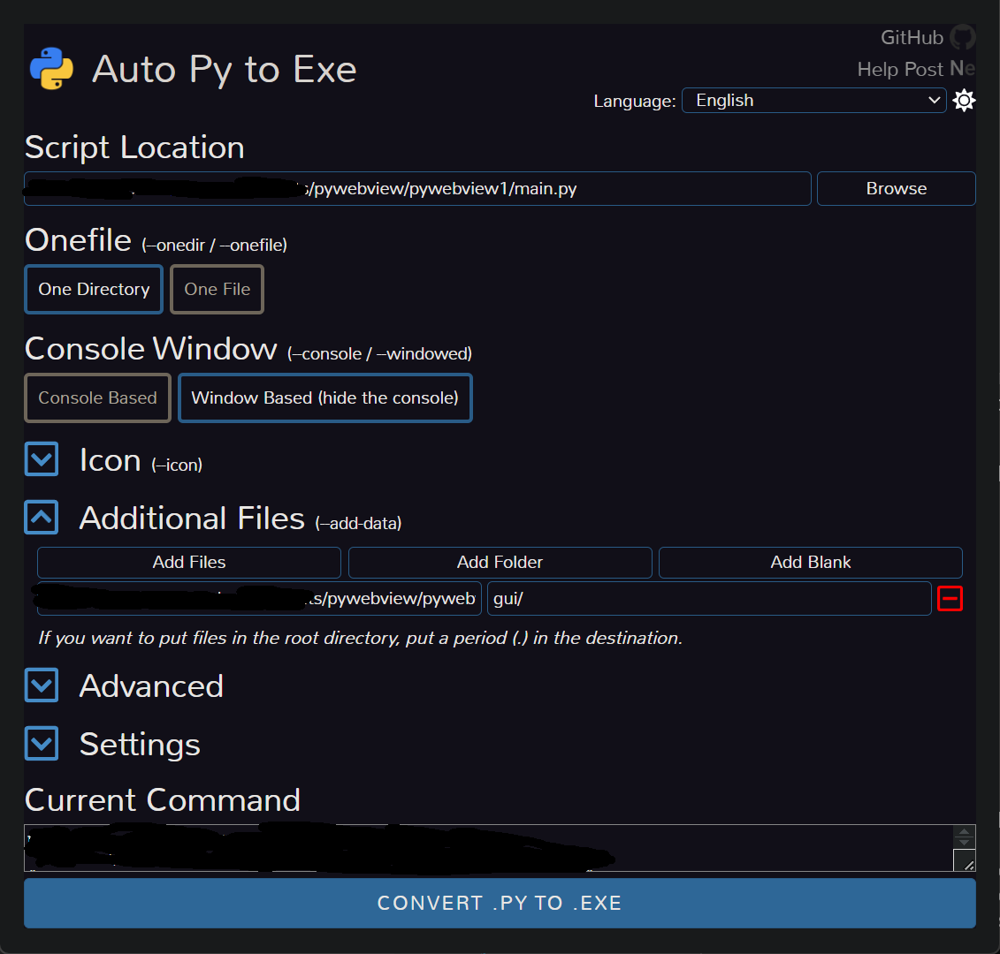

## Developing Desktop Applications with pywebview + vite

# Directory Structure

-app  vite application (frontend)

-main.py  application entry file

# Development Stage

1. Enter /app directory

`pnpm i`

`pnpm run dev`

2. Configure `main.py`

```python
if __name__ == '__main__':
    api = Api()

    window = webview.create_window('pywebview', 'http://localhost:5173', js_api=api, )
    webview.start(debug=True)
```

3. Launch the main program

Run `main.py`

# Packaging the Application
1. Enter /app directory

`pnpm run build`

2. Configure `main.py`

```python
if __name__ == '__main__':
    api = Api()

    window = webview.create_window('pywebview + vue3', server, js_api=api, )
    webview.start(debug=False)
```

3. Use `auto-py-to-exe` for packaging

```bash
pip install auto-py-to-exe
# Launch the tool
auto-py-to-exe
```

Select the entry point `main.py`, and add the gui directory generated from the vite build

